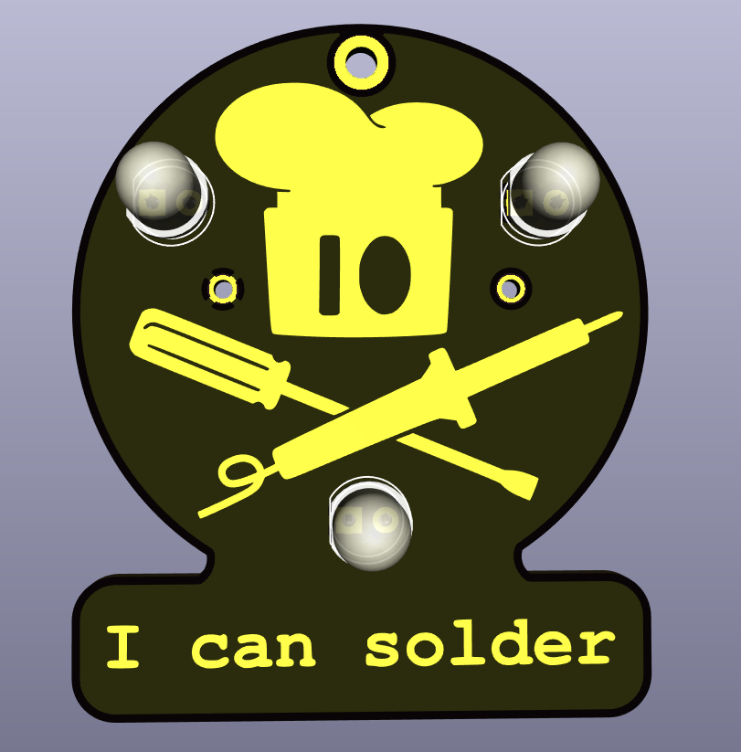
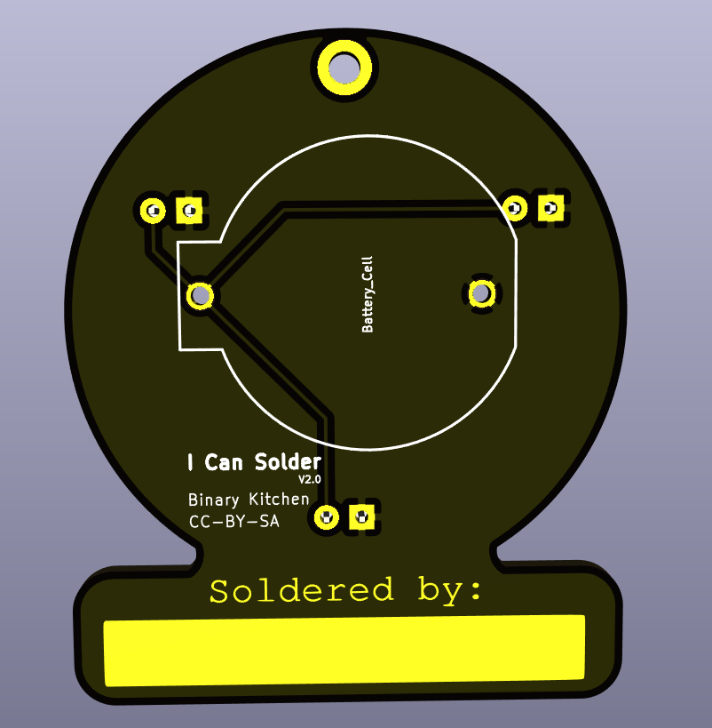

# I Can Solder - DIP
Very easy soldering kit for kids and beginners.

 

- Status: **Complete**
- Difficulty: **1/5**

### Parts List

| Menge | Name         | Beschreibung                       | Beschriftung/Farbcode                   |
|-------|--------------|------------------------------------|-----------------------------------------|
| 3     | LED1 - LED3  | LED 5mm Regenbogen                 |                                         |
| 1     |              | Batteriehalter                     |                                         |
| 1     |              | Buttefly Pin                       |                                         |
| 1     |              | Platine                            |                                         |

### Manual
You can find the manual and pictures of every step here: https://github.com/Binary-Kitchen/SolderingTutorial

### Copyright and Authorship

- Board: [CC-BY-SA 4.0](https://creativecommons.org/licenses/by-sa/4.0/) - Thomas Basler, Timo Schindler
- CR2032 Battery Holder Footprint: [[CC-BY 4.0]](https://creativecommons.org/licenses/by/4.0/) - Sparkfun (https://github.com/sparkfun/SparkFun-KiCad-Libraries)

